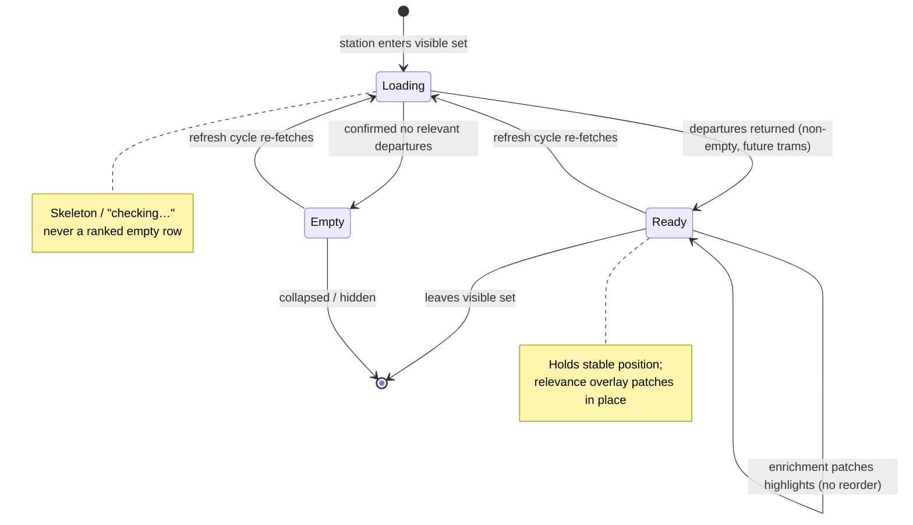
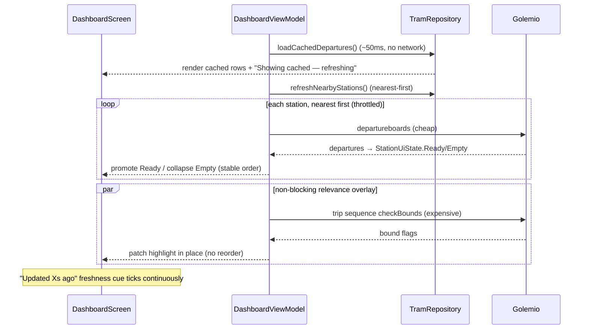

# TramApp Dashboard Trust Rework - Plan

> **Product Contract preservation:** Product Contract unchanged. Planning enriched this file in place (Planning Contract, Implementation Units, Verification Contract, Definition of Done) without altering any R/F/AE IDs or product scope. R7 (accessibility indicator) remains gated on the live-API probe (U2) exactly as the original Dependencies section framed it; its graceful-degradation path is already covered by R9.

## Goal Capsule

- **Objective:** Make the TramApp Dashboard feel fast and trustworthy — it shows only settled data, orders stations sensibly, gives clear feedback, and surfaces per-tram amenity info — all verified on an emulator before any change is called done.
- **Product authority:** Sole user/owner (brerez), primary device Samsung S22+.
- **Open blockers:** Resolved during planning. Emulator + Golemio API key are both ready on the owner's Windows machine (harness = drive/verify scripting only, not environment setup). Golemio per-trip accessibility/air-conditioning field names are pinned by U2 (live-API probe) before the model is extended in U8.

---

## Product Contract

### Summary

Rework the Dashboard so it renders only *settled* station data instead of discovery-in-progress: honest per-station loading/ready/empty states, stable ordering with no reshuffle flicker, and no lingering phantom stations. The view defaults to neutral Nearby; destination-bound highlights and favorites resolve progressively as a non-blocking relevance layer, and each departure shows accessibility and air-conditioning indicators. All of this rides on a new emulator-based verification harness that gates "done," and the plan requires implementation agents to prefer offloading self-contained work to Antigravity.

### Problem Frame

The app is used almost daily on the way to or at a tram stop, to decide *how long to wait* and *whether to wait for a preferred line* when a backup line arrives soon after. Today that moment has friction. A station close by but irrelevant (or still loading) is ranked to the top by raw proximity, shows up empty while its departures and bound-checks are still in flight, then reshuffles or vanishes once data lands — so the user scrolls to hunt for the station they actually care about. There is no clear signal of what is cached versus updating, so the app "feels slow" even though the cache reads in ~50ms. The root cause is that the UI conflates *how data loads* (necessarily incremental, because the Golemio API is rate-limited) with *how not-yet-settled data is shown*. The load model is fine; the presentation of in-flight state is what breaks trust.

### Key Decisions

- **Fix the state model, not just the visuals.** The Dashboard renders per-station load states (loading / ready / empty-and-hidden) and only promotes a station in the ordering once it has real departures. This targets the *class* of empty/vanishing/mis-ordered-station bugs rather than patching today's instances.
- **Neutral-Nearby is the default; relevance is an opt-in layer.** Opening the app shows nearby stations without guessing intent by time of day. Destination filters (Work/Home/School) and favorites are a highlighting/sorting layer on top, not a mode the user must choose first. This keeps ad-hoc use first-class, matching real usage.
- **Nearest-first fetch under the existing rate cap.** Limited API budget spends on the closest stations first, expanding outward. The cheap departures call comes first; the expensive trip-sequence bound-checks (Home/Work/School) resolve afterward and never block a row from rendering. Incremental, throttled loading stays — it is required by Golemio's limits, not a defect.
- **Destination anchor over pinned line numbers.** Relevance is expressed through saved destinations, not hard-pinned line numbers, because lines change course over months (maintenance reroutes) and would make pins stale.
- **Emulator verification gates "done."** A change is not complete until built, launched, and driven on an emulator with the expected behavior confirmed. The harness is built first so every subsequent UI change is auto-verifiable.
- **One-second glance budget per row.** A departure row commits to at most: the line badge (identity + relevance color), the countdown (the single largest, primary element), and one small low-emphasis amenity glyph cluster. Relevance is signaled once, not three times. New indicators are earned by cutting existing chrome, never by stacking — the row must be readable at a glance in outdoor daylight on an S22+.

### Requirements

**Dashboard state model & trust**

- R1. The Dashboard renders each station in an explicit state: loading (data in flight), ready (has known departures), or empty (confirmed no relevant departures). A station is never shown as a ranked, populated-looking row while its data is still in flight.
- R2. Station ordering is stable within a refresh cycle — stations do not reshuffle position as data trickles in. A station is promoted in the order only once it has real departures.
- R3. A station confirmed to have no relevant departures is collapsed or hidden rather than left lingering and later removed.
- R4. A station still resolving shows a clear skeleton / "checking…" affordance rather than an empty row that reads as "no trams."

**Nearby default & relevance layer**

- R5. The app opens to a neutral Nearby view (stations near the active location) without inferring destination intent from time of day.
- R6. Destination filters (Work / Home / School) and favorite lines are an opt-in relevance layer over the Nearby view — they highlight and can sort relevant departures without forcing the user into a destination mode. Destination-bound highlights resolve progressively and never block a row from rendering.

**Departure row content**

- R7. Each next-tram row shows an accessibility indicator (e.g., wheelchair-accessible) when the source data provides it.
- R8. Each next-tram row shows an air-conditioning indicator when the source data provides it.
- R9. Amenity indicators degrade gracefully — when the API does not provide the flag for a given trip, the row omits the indicator rather than showing a wrong or placeholder value.

**Feedback & status**

- R10. The Dashboard shows a clear, continuous signal of data freshness and activity — what is cached, what is currently updating, and when data was last refreshed.
- R11. Refresh and auto-refresh states are visibly distinguishable from a stalled or errored state.

**Fetch budget & rate management**

- R12. Under a constrained API budget, the app fetches nearest stations first and expands outward; the cheaper departures data is fetched before the more expensive destination-bound trip-sequence checks.
- R13. Existing throttling / 429 protection is preserved; the trust changes do not increase eager API load.

**Verification harness**

- R14. The project has an emulator-based verification path an agent can run to build the app, launch it on an emulator, drive the real UI, and confirm behavior (assertions and/or screenshots).
- R15. Fast JVM unit tests run on every change; the emulator drive/verify pass runs for UI-affecting changes. (Layered default — confirmed during planning.)
- R16. No change is considered done until verified on an emulator per R14–R15.

**Process discipline**

- R17. The eventual implementation plan and its agents must evaluate `/consider-offload-agy` for each self-contained unit of work and opt into offloading to Antigravity when the work is a strong candidate (self-contained files, freezable interface, high-token/low-judgment grunt work).
- R18. A design subagent reviews the current and planned Dashboard design against the goals of minimalism, slickness, clear feedback, and fit-to-requirements, and its findings feed the design direction.

**Visual clarity & information budget**

- R19. A departure row shows at most: line badge (identity + relevance color), countdown (largest/primary element), and a small low-emphasis amenity glyph cluster. The countdown never loses size or weight to make room for icons.
- R20. Home/Work/School-bound relevance is signaled by one primary cue. The current triple signal — card border gradient, emoji destination badge, and per-row glow, all stating the same fact — is reduced to one primary (plus at most one secondary) signal.
- R21. Amenity glyphs (accessibility, air-conditioning) are small, low-emphasis/monochrome, and legible at arm's length outdoors on an S22+ at default and enlarged font scales; they do not compete with the relevance color or the countdown.
- R22. The global freshness/status cue reuses the existing (currently unwired) `StatusIndicator` / `CompactStatusIndicator` primitive in the header — a muted "Updated Xs ago" — and replaces the user-facing debug counter (`Debug: N API calls…`), which is removed from the header or gated behind a dev-only affordance.
- R23. The settings entry point uses a settings/gear icon, not a star (which currently collides with the per-line favorite star).
- R24. Station expansion follows a stable rule (e.g., first *settled* station, sticky after user interaction) and does not re-trigger on every refresh or visible-station change.
- R25. The map does not occupy prime vertical space above the departure list by default — it is shrunk/collapsible and/or restyled to the dark theme — so it neither pushes the answer below the fold nor creates a bright glare rectangle outdoors.
- R26. Surface/background contrast is validated against the actual dark background and simulated outdoor glare (not only WCAG-against-white); card boundaries favor crispness over glass-blur wherever legibility competes with the glass aesthetic.

### Key Flows

- F1. Open app → Nearby resolves
  - **Trigger:** User launches the app on the way to / at a stop.
  - **Steps:** Cached departures render immediately with a freshness marker; nearest stations refresh first within the rate budget; each station shows loading → ready/empty honestly; destination-bound highlights and favorites fill in progressively without reordering settled rows.
  - **Outcome:** Within moments the user sees a stable, honestly-labeled list of nearby stations with next departures, amenity indicators, and relevance highlights.
  - **Covers:** R1, R2, R3, R4, R5, R6, R10, R12

- F2. Decide "wait for the preferred line?"
  - **Trigger:** A backup line is departing soon; the user prefers a different line.
  - **Steps:** The row surfaces the next departures per line with countdowns; favorite lines are visually marked.
  - **Outcome:** The user can see whether the preferred line follows soon enough to be worth waiting.
  - **Covers:** R6, R10

- F3. Agent verifies a change
  - **Trigger:** An agent completes a code change.
  - **Steps:** Run unit tests; for UI-affecting changes, build, launch on emulator, drive the UI, assert/screenshot; report pass/fail.
  - **Outcome:** The change is marked done only on a passing emulator verification.
  - **Covers:** R14, R15, R16

### Acceptance Examples

- AE1. **Covers R1, R4.** Given a nearby station whose departures are still loading, When the Dashboard renders, Then that station shows a "checking…" skeleton — not an empty row and not a top-ranked populated-looking row.
- AE2. **Covers R2, R3.** Given three stations loading at different speeds, When the fastest resolves with departures and a closer one resolves empty, Then the station with departures holds a stable position and the empty one collapses/hides without a visible reshuffle of the others.
- AE3. **Covers R6.** Given the neutral Nearby view with no filter active, When destination-bound checks for a departure complete, Then the relevant highlight/badge appears on that row without the row having blocked rendering or changed position.
- AE4. **Covers R7, R8, R9.** Given a departure whose trip data includes accessibility and air-conditioning flags, When the row renders, Then both indicators show; And given a departure whose trip data omits a flag, Then that indicator is simply absent.
- AE5. **Covers R16.** Given a UI-affecting change, When an agent declares it done, Then an emulator verification pass has run and passed for that change.

### Scope Boundaries

**Deferred for later**
- Glanceable surface (home-screen widget or Quick Settings tile) — the original goal, deferred until the in-app experience is trustworthy on a proven foundation.
- Relevance-weighted fetch ordering — for now the fetch order is pure nearest-first; boosting fetch priority for favorite/relevant lines is a later refinement.
- Auto-guessing destination intent by time of day (and remembered-last-filter shortcuts) — explicitly not the default; may revisit as a convenience later.

**Deferred to Follow-Up Work** (surfaced during planning; out of this plan's scope)
- Consolidating the three near-duplicate distance-filter blocks (`visibleStations`, `hasMoreStations`, `loadCachedDepartures` in `DashboardViewModel.kt`, each with its own hardcoded radius) into one shared helper — only the portions the state-model rework (U4) already rewrites are touched here; the full consolidation is a separate tidy pass.
- Extracting the repeated `"\\s*\\[.*]$"` platform-suffix stripping regex (used in ~6 sites) into a single utility.

### Dependencies / Assumptions

- **Golemio amenity fields (resolved by U2 — CONFIRMED live 2026-07-18).** The Golemio v2 `pid/departureboards` response nests both amenity flags per-trip as JSON booleans: **`trip.is_wheelchair_accessible`** (R7) and **`trip.is_air_conditioned`** (R8). Both were observed present and non-null in the live sample (Letenské náměstí `U324Z2P`, `airCondition=true`), so **neither R7 nor R8 degrades** — the R9 null-omit path remains only for trips where a flag is genuinely absent. The current `TripInfo` model parses only `headsign` and trip `id` (`app/src/main/java/com/example/tramapp/data/remote/GolemioModels.kt`); U8 adds these two confirmed fields as nullable `@SerializedName` booleans. (Stop-level `wheelchair_boarding` also exists but the per-trip `trip.is_wheelchair_accessible` is the correct source for a departure row.)
- **Emulator + API key on Windows (ready).** Confirmed available during planning: a runnable Android emulator on the owner's Windows machine and `GOLEMIO_API_KEY` present in `local.properties` (read via `buildConfigField`). The harness (U1) therefore adds drive/verify scripting only, not environment provisioning.
- **Existing test scaffolding.** Espresso + Compose UI Test dependencies are already declared (`app/build.gradle.kts`), and JVM unit tests exist under `app/src/test/`. No instrumented (`androidTest`) tests and no emulator/CI config exist yet — the harness is greenfield on top of present dependencies. A live-API JVM test pattern already exists (`app/src/test/java/com/example/tramapp/domain/RealApiIntegrationTest.kt`, reading `local.properties`), which U2 reuses.

---

## Planning Contract

### Process Discipline (R17, R18)

- **Offload evaluation (R17).** Before starting each self-contained unit, the implementing agent evaluates `/consider-offload-agy` and offloads to Antigravity when the unit is a strong candidate. Strongest candidates in this plan are flagged in their unit's Execution note: **U1** (harness scripting — new files, freezable interface, high-token/low-judgment), **U2** (live-API probe), and **U8** (model/serialization extension).
- **Design review (R18).** **U3** runs a design subagent over the current and planned Dashboard; its findings are an explicit input to U9 (row visual budget), U10 (status/chrome), and U11 (map + contrast). U3 is sequenced early so those findings land before the visual units execute.

### Key Technical Decisions

- **KTD1 — Explicit `StationUiState` sealed model (R1–R4).** Introduce a per-station UI state (`Loading`, `Ready(departures)`, `Empty`) held in the ViewModel, replacing today's implicit "a station has data iff it's a key in `_rawStationDepartures`." Ordering and promotion are computed from this state so a station is only promoted once `Ready`. This is the structural root-cause fix everything else depends on.
- **KTD2 — Ordering is a pure function of settled state, computed once per cycle (R2, R24).** The visible list is derived as: settled `Ready` stations sorted by distance (stable), then `Loading` stations shown as skeletons in distance order, with `Empty` collapsed out. `remember`ed/`derivedStateOf` snapshots prevent re-sort on every trickle. Expansion targets the first *settled* station and is sticky after user interaction.
- **KTD3 — Relevance is an overlay that never gates a row (R6).** Departure rows render immediately from the cheap `departureboards` call; the expensive `checkBounds` trip-sequence results patch highlight state in place (they already run in a separate `enrichStation` job). The plan formalizes this so a pending bound-check can never delay or reorder a `Ready` row.
- **KTD4 — Amenity flags are nullable `Boolean?` on `SmartDeparture` (R7–R9).** `null` = unknown (omit indicator), `true`/`false` = known. Parsed from the fields U2 confirms, threaded through `DepartureEntity` cache so cached rows keep amenities across restarts.
- **KTD5 — Single relevance cue = colored line badge; drop card gradient + per-row glow (R19, R20).** The line badge carries identity + relevance color as the one primary cue; the "Towards home/work/school" subtitle is the single allowed secondary. The `StationGroupCard` border gradient and the emoji `DestinationBadge` row are removed (or the badge demoted to at-most-secondary). Countdown keeps its size/weight (R19).
- **KTD6 — Reuse `StatusIndicator`/`CompactStatusIndicator`; delete the debug counter from the header (R10, R11, R22).** Feed the header a real `AppStatus` (freshness timestamp + connection state) instead of the `Debug: N API calls` string; the API-call counter moves behind a dev-only flag (owner opted to keep it gated, not deleted outright — resolvable in U10).
- **KTD7 — Emulator drive via Compose UI Test + `adb`/Gradle `connectedCheck` (R14–R16).** Instrumented tests under `app/src/androidTest/` drive the real UI with test tags; a documented script (`connectedDebugAndroidTest` + screenshot capture) is the agent-runnable verify path. Layered: `test` (JVM) on every change, `connectedCheck` for UI-affecting changes.

---

## High-Level Technical Design

### Per-station state machine (R1–R4)

The core fix models each visible station as an explicit state. A station is only *promoted* into the ranked, populated list when it reaches `Ready`; `Loading` renders a skeleton; `Empty` collapses out.



### Open → Nearby resolve (F1): cheap-before-expensive, non-blocking relevance

Directional sketch of the load sequence the state model enforces — cached data paints first, the cheap departures call settles each station, and the expensive bound-checks patch highlights without gating or reordering rows.



---

## Output Structure

New files introduced by this plan (existing files modified in place are listed per unit):

```
app/src/
├── main/java/com/example/tramapp/
│   └── ui/
│       └── StationUiState.kt              # U4 — sealed state model
└── androidTest/java/com/example/tramapp/  # U1 — new instrumented test source set
    ├── DashboardTrustFlowTest.kt          # U1/U5 — drive/verify UI states
    └── util/
        └── ScreenshotUtil.kt              # U1 — screenshot capture helper
docs/
└── verification-harness.md                # U1 — agent-runnable verify recipe
```

---

## Implementation Units

### U1. Emulator verification harness

- **Goal:** Give an agent a documented, runnable path to build, launch, drive, and screenshot the app on the ready emulator, plus the `androidTest` source set the later UI units assert against. Built first so every subsequent UI change is auto-verifiable.
- **Requirements:** R14, R15, R16.
- **Dependencies:** None.
- **Files:**
  - `app/src/androidTest/java/com/example/tramapp/DashboardTrustFlowTest.kt` (create — smoke test that launches `MainActivity` and asserts the Dashboard renders)
  - `app/src/androidTest/java/com/example/tramapp/util/ScreenshotUtil.kt` (create — capture device screenshots into a known output dir)
  - `docs/verification-harness.md` (create — the agent recipe: `./gradlew test`, `./gradlew connectedDebugAndroidTest`, emulator boot check, screenshot pull)
  - `app/build.gradle.kts` (modify — ensure `androidTest` deps/test runner wired; add screenshot/rule deps if needed)
- **Approach:** Use the already-declared Espresso + Compose UI Test deps. Add a minimal `createAndroidComposeRule<MainActivity>()` smoke test. `ScreenshotUtil` writes PNGs an agent can pull via `adb`. `docs/verification-harness.md` is the canonical R14 recipe: preconditions (emulator running, `GOLEMIO_API_KEY` in `local.properties`), the two Gradle commands, and how to read pass/fail + screenshots. Establish `Modifier.testTag(...)` conventions here (station-card, skeleton, empty-collapse, amenity-glyph tags) that U5/U9 attach to.
- **Execution note:** Strong `/consider-offload-agy` candidate — self-contained new files + freezable interface (the test-tag vocabulary and screenshot output contract). Offload the scripting/boilerplate; keep the test-tag contract decision local.
- **Patterns to follow:** Live-API/`local.properties` wiring from `app/src/test/java/com/example/tramapp/domain/RealApiIntegrationTest.kt`; existing JVM test style under `app/src/test/`.
- **Test scenarios:**
  - Happy path: `connectedDebugAndroidTest` launches `MainActivity`, waits for the Dashboard, asserts the "Nearby Stations" title node exists; run succeeds on the ready emulator. **Covers AE5.**
  - Screenshot: `ScreenshotUtil` produces a non-empty PNG at the documented path after the smoke test.
  - Recipe integrity: following `docs/verification-harness.md` verbatim from a clean checkout (emulator up) yields a green `connectedDebugAndroidTest`.
- **Verification:** `./gradlew connectedDebugAndroidTest` passes on the emulator and a screenshot artifact is produced; `docs/verification-harness.md` steps reproduce it.

---

### U2. Golemio amenity-field probe

- **Goal:** Pin the exact departure-board field names/nesting for accessibility (wheelchair) and air-conditioning against the live API, so U8 extends the model against real fields rather than guesses. Gates R7–R8.
- **Requirements:** R7, R8, R9 (field discovery).
- **Dependencies:** None (can run parallel to U1).
- **Files:**
  - `app/src/test/java/com/example/tramapp/data/remote/GolemioAmenityProbeTest.kt` (create — live-API JVM test that fetches a real `departureboards` response and prints the raw JSON + any amenity-bearing fields)
- **Approach:** Clone the Retrofit-with-`x-access-token` setup from `RealApiIntegrationTest`. Call `departureboards` for a known busy stop (e.g. the `U324Z2P` used in the existing test) with the `airCondition` query param on, and dump the full raw response body. Inspect for wheelchair/accessibility and air-conditioning fields at the departure, `trip`, and any vehicle/train nesting. Record the confirmed field names, nesting path, and value type (bool vs enum vs int) as a short comment block at the top of the test **and** update this plan's Dependencies note + U8 approach with the findings. If wheelchair data is absent, record that R7 degrades to AC-only per R9.
- **Execution note:** Strong `/consider-offload-agy` candidate — self-contained, mechanical live-API dump. The *decision* about which fields to adopt stays with the implementer.
- **Patterns to follow:** `app/src/test/java/com/example/tramapp/domain/RealApiIntegrationTest.kt` (setup, `local.properties` key, base URL `https://api.golemio.cz/v2/`).
- **Test scenarios:**
  - Discovery: probe fetches a non-empty `departureboards` response and logs the raw JSON; test asserts departures are present so the dump is meaningful.
  - Field assertion (once names known): assert the confirmed accessibility and/or AC field is present and parses to the expected type for at least one departure.
  - Absence handling: if a probed field is absent from the sample, the test documents it (no false claim that R7/R8 are both firm).
- **Verification:** Running the probe prints the amenity field path(s); the confirmed names are written into U8's approach and this plan's Dependencies note before U8 starts.

---

### U3. Design subagent review (R18)

- **Goal:** Review the current and planned Dashboard against minimalism, slickness, clear feedback, and fit-to-requirements; produce concrete direction that feeds the visual units (U9, U10, U11).
- **Requirements:** R18.
- **Dependencies:** None (parallel to U1/U2); must complete before U9–U11 execute.
- **Files:**
  - `docs/design-review-dashboard.md` (create — the subagent's findings and the resolved direction on the R19–R26 forks)
- **Approach:** Dispatch a design-focused review over `DashboardScreen.kt`, `TramRow.kt`, `StationGroupCard.kt`, and `StatusIndicator.kt` plus this plan's KTD5–KTD6 and R19–R26. Capture: which single relevance cue reads best on an S22+ outdoors (validate KTD5's colored-badge choice), amenity glyph shape/size candidates (R21), map treatment options (R25), and dark/glare contrast concerns against `Color.kt` values (R26). Output is direction, not code.
- **Execution note:** Findings are inputs to U9–U11; record any that override a KTD here and reconcile in those units.
- **Patterns to follow:** Existing theme tokens in `app/src/main/java/com/example/tramapp/ui/theme/Color.kt`.
- **Test scenarios:** Test expectation: none — documentation/design-direction unit, no behavioral change.
- **Verification:** `docs/design-review-dashboard.md` exists and resolves (or explicitly defers) each of R19–R26's design forks; U9–U11 cite it.

---

### U4. Per-station `StationUiState` model + stable ordering

- **Goal:** Replace the implicit "has data = is a map key" model with an explicit per-station state, and make the visible ordering a stable function of settled state. Root-cause fix for empty/vanishing/reshuffling stations.
- **Requirements:** R1, R2, R3, R4, R24.
- **Dependencies:** None (but U5 renders it).
- **Files:**
  - `app/src/main/java/com/example/tramapp/ui/StationUiState.kt` (create — `sealed interface StationUiState { Loading; Ready(departures); Empty }`)
  - `app/src/main/java/com/example/tramapp/ui/DashboardViewModel.kt` (modify — expose `StateFlow<Map<String, StationUiState>>` or a derived ordered `List<StationRow>`; set `Loading` when `refreshStation` starts, `Ready`/`Empty` on result; promote only `Ready` into the ranked order; keep enrichment patching highlights without changing state identity)
  - `app/src/test/java/com/example/tramapp/ui/DashboardViewModelStateTest.kt` (create)
- **Approach:** Introduce `StationUiState`. In `refreshStation`, transition the station to `Loading` on entry (already tracked loosely by `_loadingStations`), then to `Ready(deps.take(5))` when departures are non-empty future trams, else `Empty`. Derive the ordered visible list: `Ready` stations sorted by distance (stable), `Loading` shown as skeletons in distance order, `Empty` excluded. Ensure `enrichStation`'s highlight patch updates the `Ready` payload without demoting/reordering. Preserve `favoritesFirst` sorting as a stable secondary key.
- **Execution note:** Start with a failing unit test for the promotion/collapse rule (test-first) — this is the correctness core of the rework.
- **Patterns to follow:** Existing `combine` + `stateIn` flows and `refreshStation`/`enrichStation` structure in `DashboardViewModel.kt`; existing `DashboardViewModelTest.kt`.
- **Test scenarios:**
  - Happy path: a station whose `refreshStation` returns future trams transitions `Loading → Ready` and appears in the ordered list. **Covers R1, R2.**
  - Empty collapse: a station returning no future/relevant trams transitions `Loading → Empty` and is excluded from the visible list. **Covers R3, AE2.**
  - Stable order: three stations resolving at different speeds — the faster `Ready` one holds its position while a closer one resolves `Empty`; no reordering of already-`Ready` rows. **Covers R2, AE2.**
  - Non-blocking enrichment: a `Ready` station whose `checkBounds` later flips a bound flag stays in the same position and same state identity (highlight patched only). **Covers R6-support, AE3.**
  - Edge: station leaves the visible set while `Loading` — no stale `Loading`/`Empty` entry lingers.
  - Edge: refresh cycle re-fetches a `Ready` station — it does not flicker to `Loading` visibly if cached data is still valid (or transitions cleanly per rule).
- **Verification:** `./gradlew test` green for the new state tests; promotion, collapse, and stable-order scenarios pass.

---

### U5. Dashboard renders honest per-station states

- **Goal:** Render `Loading` as a "checking…" skeleton, `Empty` as collapsed/hidden, and `Ready` as the populated card — with stable, non-re-triggering expansion. Removes the empty-row-reads-as-"no trams" and phantom-station behaviors.
- **Requirements:** R1, R3, R4, R24.
- **Dependencies:** U4.
- **Files:**
  - `app/src/main/java/com/example/tramapp/ui/DashboardScreen.kt` (modify — consume the ordered `StationUiState` list; render skeleton vs card vs collapsed; fix the auto-expand `LaunchedEffect` to target the first *settled* station and stay sticky after user toggles)
  - `app/src/main/java/com/example/tramapp/ui/components/StationGroupCard.kt` (modify — accept an explicit state; show `Loading` affordance instead of an empty expanded body; attach `testTag`s from U1)
  - `app/src/androidTest/java/com/example/tramapp/DashboardTrustFlowTest.kt` (modify — assert skeleton-then-ready and empty-collapse via tags)
- **Approach:** Drive `itemsIndexed` off the U4 ordered list. For `Loading`, render the existing `SkeletonRow`/a "checking…" affordance keyed by test tag rather than an empty card. For `Empty`, omit the item (collapse). Replace the current `LaunchedEffect(visibleStations)` auto-expand so it expands the first `Ready` station once and does not re-fire when the visible set trickles (guard on "user has interacted" + "already chose a settled target").
- **Execution note:** UI-affecting — gated by the U1 emulator drive per R16.
- **Patterns to follow:** Existing `SkeletonRow`, `itemsIndexed`, and `expandedStations` map in `DashboardScreen.kt`.
- **Test scenarios:**
  - Happy path (instrumented): a station in `Loading` shows the skeleton/"checking…" node; when it becomes `Ready`, the populated card replaces it in the same slot. **Covers R1, R4, AE1.**
  - Empty collapse (instrumented): an `Empty` station renders no card and does not leave a lingering row. **Covers R3, AE2.**
  - Expansion stability: first settled station auto-expands once; a later refresh/visible-set change does not collapse or move the user's expanded station. **Covers R24.**
  - Edge: all nearby stations `Loading` on cold start → list shows skeletons, never empty populated-looking rows.
- **Verification:** `connectedDebugAndroidTest` passes the skeleton→ready and empty-collapse assertions; screenshot confirms no empty "no trams" rows during load.

---

### U6. Neutral Nearby default + non-blocking relevance layer

- **Goal:** Guarantee the app opens to neutral Nearby (no time-of-day intent) and that destination/favorite relevance is a pure overlay that never blocks or reorders a rendered row.
- **Requirements:** R5, R6.
- **Dependencies:** U4.
- **Files:**
  - `app/src/main/java/com/example/tramapp/ui/DashboardViewModel.kt` (modify — confirm no time-of-day branch influences default ordering; ensure `enrichStation` highlight patches are decoupled from row promotion; favorites act as a stable sort key only)
  - `app/src/test/java/com/example/tramapp/ui/DashboardViewModelStateTest.kt` (modify — relevance-overlay tests)
- **Approach:** Audit the init/ordering path to confirm neutrality (the current code already has no time-of-day intent — this unit formalizes and tests it). Ensure the relevance overlay (bound flags, favorite marks) only affects highlight/sort among already-`Ready` rows and can arrive late without moving a row's slot within a refresh cycle.
- **Patterns to follow:** `enrichStation` + `favoritesFirst` combine in `DashboardViewModel.kt`.
- **Test scenarios:**
  - Happy path: with no filter active, the ordered list is distance-sorted Nearby; no destination inference from clock time. **Covers R5.**
  - Overlay non-blocking: a bound-check completing after a row is `Ready` patches the highlight without changing the row's index. **Covers R6, AE3.**
  - Favorites: enabling favorites-first reorders lines within a station stably without destabilizing station order.
- **Verification:** `./gradlew test` green; relevance-overlay and neutral-default scenarios pass.

---

### U7. Nearest-first fetch, cheap-before-expensive, throttle preserved

- **Goal:** Make fetch order explicitly nearest-first and expanding outward, with the cheap `departureboards` call always preceding the expensive trip-sequence bound-checks, without increasing eager API load.
- **Requirements:** R12, R13.
- **Dependencies:** U4.
- **Files:**
  - `app/src/main/java/com/example/tramapp/ui/DashboardViewModel.kt` (modify — order `refreshStation` dispatch by distance; ensure departures resolve before `enrichStation` bound-checks are scheduled; preserve inter-call delays)
  - `app/src/main/java/com/example/tramapp/data/repository/TramRepository.kt` (modify only if fetch ordering needs a repo-level change)
  - `app/src/test/java/com/example/tramapp/ui/DashboardViewModelFetchOrderTest.kt` (create)
- **Approach:** The pieces largely exist (`selectStationsByName` by distance, `enrichStation` runs after departures). This unit makes the ordering explicit and tested: dispatch stations nearest-first; the cheap call gates the row; bound-checks are queued only after. Keep the existing 300–500ms inter-call delays and `ThrottleUtil` 429 handling untouched (R13) — assert call volume does not increase versus current behavior.
- **Patterns to follow:** `startDepartureLoop`, `refreshStation`, `enrichStation`, `ThrottleUtil` in the repository.
- **Test scenarios:**
  - Ordering: given stations at increasing distance, `refreshStation` is invoked nearest-first. **Covers R12.**
  - Cheap-before-expensive: `getSmartDepartures.execute` (departures) completes and the row is `Ready` before `checkBounds` is scheduled for that station. **Covers R12.**
  - Throttle preserved: the trust changes do not add API calls per cycle beyond the current baseline; `ThrottleUtil` still backs off on a simulated 429. **Covers R13.**
- **Verification:** `./gradlew test` green; fetch-order and no-extra-load scenarios pass; existing `ThrottleUtilTest`/`ThrottleUtilConcurrencyTest` still green.

---

### U8. Amenity model extension (accessibility + air-conditioning)

- **Goal:** Parse the confirmed amenity fields, thread them through the cache, and expose nullable amenity flags on `SmartDeparture` for the row to render. Graceful degradation when a flag is absent.
- **Requirements:** R7, R8, R9.
- **Dependencies:** U2 (confirmed field names).
- **Files:**
  - `app/src/main/java/com/example/tramapp/data/remote/GolemioService.kt` (modify — add the `airCondition` query param to `getDepartures` if U2 confirms the AC field is only returned when requested)
  - `app/src/main/java/com/example/tramapp/data/remote/GolemioModels.kt` (modify — add the confirmed amenity fields to `TripInfo`/`DepartureItem` with `@SerializedName`, nullable)
  - `app/src/main/java/com/example/tramapp/domain/GetSmartDeparturesUseCase.kt` (modify — surface `isAccessible: Boolean?`, `isAirConditioned: Boolean?` on `SmartDeparture`)
  - `app/src/main/java/com/example/tramapp/data/local/entity/DepartureEntity.kt` (modify — persist amenity flags)
  - `app/src/main/java/com/example/tramapp/data/local/TramDatabase.kt` (modify — Room migration/version bump for the new columns)
  - `app/src/main/java/com/example/tramapp/data/repository/TramRepository.kt` (modify — map amenity fields in `saveDeparturesToCache`/`getCachedDepartures`)
  - `app/src/test/java/com/example/tramapp/data/repository/TramRepositoryAmenityTest.kt` (create)
- **Approach:** Add the U2-confirmed fields (nullable). Extend `SmartDeparture` with `isAccessible`/`isAirConditioned` (`Boolean?`, KTD4). Persist to `DepartureEntity` with a Room schema bump + migration so cached rows retain amenities. `null` throughout means "unknown → omit indicator" (R9). If U2 found no wheelchair field, `isAccessible` stays hardcoded `null` and R7 degrades to AC-only, documented here.
- **Execution note:** Strong `/consider-offload-agy` candidate — mechanical serialization/entity/migration plumbing behind a frozen `SmartDeparture` interface.
- **Patterns to follow:** Existing `@SerializedName` models in `GolemioModels.kt`; `saveDeparturesToCache`/`getCachedDepartures` mapping in `TramRepository.kt`; existing Room entities.
- **Test scenarios:**
  - Parse present: a departure JSON with amenity fields deserializes to non-null `isAccessible`/`isAirConditioned`. **Covers R7, R8.**
  - Parse absent: a departure JSON missing a flag yields `null` for that flag (no crash, no default `false` masquerading as known). **Covers R9, AE4.**
  - Cache round-trip: saving then reading cached departures preserves amenity flags including `null`.
  - Migration: Room migration adds the columns without data loss on an existing DB.
- **Verification:** `./gradlew test` green; parse-present, parse-absent, cache round-trip, and migration scenarios pass.

---

### U9. Departure row: amenity glyphs + single-cue visual budget

- **Goal:** Render small, low-emphasis, monochrome amenity glyphs and collapse the triple relevance signal to one primary cue (colored line badge) — without shrinking the countdown.
- **Requirements:** R19, R20, R21.
- **Dependencies:** U5, U8, U3 (design direction).
- **Files:**
  - `app/src/main/java/com/example/tramapp/ui/components/TramRow.kt` (modify — add amenity glyph cluster; keep countdown primary; ensure badge carries relevance color)
  - `app/src/main/java/com/example/tramapp/ui/components/StationGroupCard.kt` (modify — remove the border-gradient highlight and emoji `DestinationBadge` row per KTD5, or demote per U3)
  - `app/src/androidTest/java/com/example/tramapp/DashboardTrustFlowTest.kt` (modify — assert glyph presence/absence via tags)
- **Approach:** Per KTD5/U3: the line badge (already colored via `accentColor`) is the single primary relevance cue; keep the "Towards …" subtitle as the one secondary. Remove `StationGroupCard`'s gradient border + emoji badges. In `TramRow`, add a small monochrome glyph cluster (accessibility + AC) rendered only when the corresponding flag is non-null; glyphs sized/weighted below the countdown (R21). Countdown keeps `fontSize`/`FontWeight` (R19). Use `material-icons-extended` (already a dep) for wheelchair/AC glyphs; verify at default and enlarged font scales.
- **Execution note:** UI-affecting — emulator drive + screenshot at default and enlarged font scale per R21.
- **Patterns to follow:** Existing `TramRow` badge/countdown layout; `material-icons-extended` usage.
- **Test scenarios:**
  - Happy path (instrumented): a departure with both flags shows both glyphs, small and beside the countdown; countdown size unchanged. **Covers R19, R21, AE4.**
  - Absent flag: a departure with `null` accessibility shows only the AC glyph (or none). **Covers R9, AE4.**
  - Single cue: a home/work/school-bound row shows exactly one primary relevance cue (colored badge) — no card gradient, no emoji badge row. **Covers R20.**
  - Font scale: glyphs remain legible and non-overlapping at enlarged font scale (screenshot check). **Covers R21.**
- **Verification:** `connectedDebugAndroidTest` + screenshots confirm single-cue relevance, amenity glyphs present/absent correctly, and an unshrunk countdown at both font scales.

---

### U10. Freshness/status header + settings gear + debug counter

- **Goal:** Wire the existing status primitive into the header as a muted "Updated Xs ago" freshness/activity cue, distinguish refresh/auto-refresh from stalled/errored, gate the debug counter behind a dev flag, and switch the settings entry point to a gear icon.
- **Requirements:** R10, R11, R22, R23.
- **Dependencies:** U4 (state feeds freshness), U3 (chrome direction).
- **Files:**
  - `app/src/main/java/com/example/tramapp/ui/DashboardScreen.kt` (modify — `HeaderSection`: replace `Debug: N API calls…` with `CompactStatusIndicator`/"Updated Xs ago"; swap `Icons.Default.Star` → `Icons.Default.Settings`; gate the counter behind a dev flag)
  - `app/src/main/java/com/example/tramapp/ui/DashboardViewModel.kt` (modify — expose an `AppStatus`/last-updated timestamp + connection state derived from refresh activity and `throttleUntil`)
  - `app/src/main/java/com/example/tramapp/ui/components/StatusIndicator.kt` (modify only if the freshness "Updated Xs ago" text/format needs a variant)
  - `app/src/androidTest/java/com/example/tramapp/DashboardTrustFlowTest.kt` (modify — assert gear icon + freshness text present, debug string absent)
- **Approach:** Build an `AppStatus` in the ViewModel: `lastUpdateTime` set on each successful refresh, `connection = LOADING` during a refresh, `ERROR` when `throttleMessage`/error is active, `ONLINE` otherwise (R11). Feed `CompactStatusIndicator` (or a small "Updated Xs ago" that ticks off `currentTime`) into `HeaderSection`, replacing the debug line (R22). The API-call counter moves behind a `BuildConfig.DEBUG`/dev flag (owner opted to keep-but-gate). Replace the star settings icon with a gear (R23).
- **Execution note:** UI-affecting — emulator drive per R16.
- **Patterns to follow:** `StatusIndicator`/`CompactStatusIndicator`/`AppStatus` in `StatusIndicator.kt`; `currentTime` tick and `throttleMessage` flows in the ViewModel.
- **Test scenarios:**
  - Freshness: after a successful refresh, the header shows "Updated Xs ago" and the value increases over time. **Covers R10.**
  - State distinction: during a refresh the indicator reads loading; on throttle/error it reads error, visibly distinct from a normal idle "updated" state. **Covers R11.**
  - Debug gated: in a non-debug build the `Debug: N API calls…` string is absent from the header. **Covers R22.**
  - Gear icon: the settings entry point uses the gear icon, not the star. **Covers R23.**
- **Verification:** `connectedDebugAndroidTest` confirms gear icon + freshness cue present and debug string absent; error vs updated states are visibly distinct in screenshots.

---

### U11. Map treatment + contrast validation

- **Goal:** Stop the map from occupying prime vertical space above the list by default (shrink + collapsible + dark restyle) and validate surface/background contrast against the real dark background and simulated glare.
- **Requirements:** R25, R26.
- **Dependencies:** U3 (map + contrast direction), U5 (list layout settled).
- **Files:**
  - `app/src/main/java/com/example/tramapp/ui/DashboardScreen.kt` (modify — `GoogleMapComponent`: make the map collapsible/shrunk by default; apply a dark map style; ensure it doesn't push the first station below the fold)
  - `app/src/main/java/com/example/tramapp/ui/theme/Color.kt` (modify only if contrast validation requires token adjustments)
  - `app/src/main/java/com/example/tramapp/ui/components/MapStyleConfig.kt` (modify — dark map style JSON; currently the inline style is light/tan)
  - `app/src/androidTest/java/com/example/tramapp/DashboardTrustFlowTest.kt` (modify — assert first station is visible above the fold by default)
- **Approach:** Replace the current inline light map style (the tan `#ebe3cd` palette in `GoogleMapComponent`) with a dark style, and make the 200dp map collapsible/shrunk so the first `Ready` station is visible without scrolling (R25). Validate card/background contrast against `DeepBlack`/`SurfaceGlass`/`GlassBorder` under simulated glare, favoring crisp card borders over glass-blur where legibility competes (R26); adjust `Color.kt`/border tokens if the design review flags failures.
- **Execution note:** UI-affecting — emulator drive + screenshots (default and simulated-glare/brightness) per R16, R26.
- **Patterns to follow:** `MapStyleConfig.kt`, `GoogleMapComponent` in `DashboardScreen.kt`, theme tokens in `Color.kt`.
- **Test scenarios:**
  - Above the fold (instrumented): on default layout, the first station card is visible without scrolling. **Covers R25.**
  - Collapsible: the map can be collapsed/expanded and its state doesn't destabilize the list. **Covers R25.**
  - Dark restyle: the map renders in the dark palette (no bright tan rectangle) — screenshot check. **Covers R25.**
  - Contrast: card boundaries remain legible against the dark background under a simulated bright/glare screenshot; documented pass or token adjustment. **Covers R26.**
- **Verification:** `connectedDebugAndroidTest` confirms first station above the fold; screenshots confirm dark map and legible cards under simulated glare.

---

## Verification Contract

- **Every change (R15):** `./gradlew test` (JVM unit tests) is green, including the new state/fetch/amenity tests and the existing suite under `app/src/test/`.
- **UI-affecting change (R14–R16):** `./gradlew connectedDebugAndroidTest` passes on the ready emulator and produces screenshot artifacts, per `docs/verification-harness.md`. Applies to U1, U5, U9, U10, U11.
- **No change is done until verified on the emulator per R16.** The harness (U1) must land before the UI units it verifies.
- **Rate discipline (R13):** the existing `ThrottleUtil` tests stay green and per-cycle API call volume does not exceed the current baseline.

## Definition of Done

- All of R1–R26 satisfied or explicitly degraded with documented rationale (R7 degradation only if U2 confirms no wheelchair field).
- The emulator harness (U1) exists and `docs/verification-harness.md` reproduces a green `connectedDebugAndroidTest` + screenshots.
- Stations render honest Loading/Ready/Empty states with stable ordering and no phantom rows (AE1, AE2).
- Relevance is a non-blocking overlay; app opens neutral-Nearby (AE3).
- Amenity indicators show when data is present and are absent when it isn't (AE4).
- One primary relevance cue per row; countdown unshrunk; amenity glyphs legible at default + enlarged font scale.
- Freshness "Updated Xs ago" cue live; debug counter gated; settings gear icon in place.
- Map shrunk/collapsible/dark; first station above the fold; contrast validated under simulated glare.
- Every UI-affecting unit verified on the emulator (AE5); full `./gradlew test` green.

---

## Risks & Dependencies

- **R7 wheelchair field may be absent.** Mitigated by U2 probing before U8; if absent, R7 degrades to AC-only per R9 — no fabricated indicator.
- **Room migration risk (U8).** Schema bump for amenity columns must migrate existing cached departures cleanly; covered by a migration test scenario.
- **Emulator flakiness / boot state.** Harness assumes the emulator is running; `docs/verification-harness.md` includes a boot/precondition check. Instrumented tests should use idling/wait-for-node rather than fixed sleeps.
- **Non-blocking overlay correctness (U4/U6).** The subtle failure mode is a late bound-check reordering a settled row; explicitly tested (AE3) rather than assumed.
- **Sequencing:** U1 (harness) and U2 (probe) are the true prerequisites — U1 gates all UI verification, U2 gates U8. U3 must precede U9–U11. U4 gates U5/U6/U7 and feeds U10.

## Sources / Research

- Current UX flow, auto-refresh, progressive reveal: `app/src/main/java/com/example/tramapp/ui/DashboardViewModel.kt`, `app/src/main/java/com/example/tramapp/ui/DashboardScreen.kt`, `app/src/main/java/com/example/tramapp/ui/components/TramRow.kt`, `app/src/main/java/com/example/tramapp/ui/components/StationGroupCard.kt`.
- Destination-bound relevance logic: `app/src/main/java/com/example/tramapp/domain/GetSmartDeparturesUseCase.kt`, `app/src/main/java/com/example/tramapp/domain/DestinationLineCacheUseCase.kt`.
- Location / nearby discovery and radius: `app/src/main/java/com/example/tramapp/domain/location/LocationStateManager.kt`, `app/src/main/java/com/example/tramapp/ui/DashboardViewModel.kt` (distance filter, default 750m).
- API models to extend for amenities: `app/src/main/java/com/example/tramapp/data/remote/GolemioModels.kt`; service surface `app/src/main/java/com/example/tramapp/data/remote/GolemioService.kt`.
- Rate limiting: `app/src/main/java/com/example/tramapp/utils/ThrottleUtil.kt`; retry/throttle wiring in `app/src/main/java/com/example/tramapp/data/repository/TramRepository.kt`.
- Status primitive (currently unwired): `app/src/main/java/com/example/tramapp/ui/components/StatusIndicator.kt`.
- Live-API test pattern for U2: `app/src/test/java/com/example/tramapp/domain/RealApiIntegrationTest.kt`.
- Test scaffolding present, no emulator/androidTest yet: `app/build.gradle.kts`, `app/src/test/`.
- Golemio PID departure-boards API (fields confirmed by U2 probe against live API; docs are a JS-rendered SPA): [Public Transport | Golemio API Documentation](https://api.golemio.cz/pid/docs/openapi/). The v2 `departureboards` endpoint exposes an `airCondition` query parameter.
