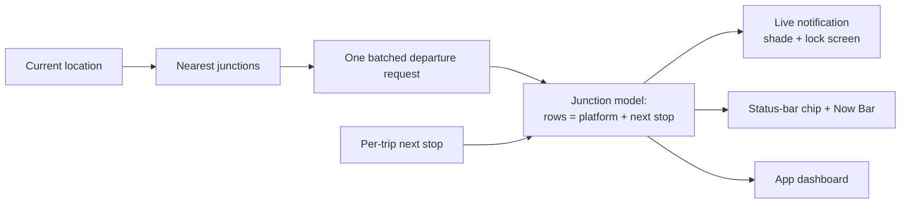
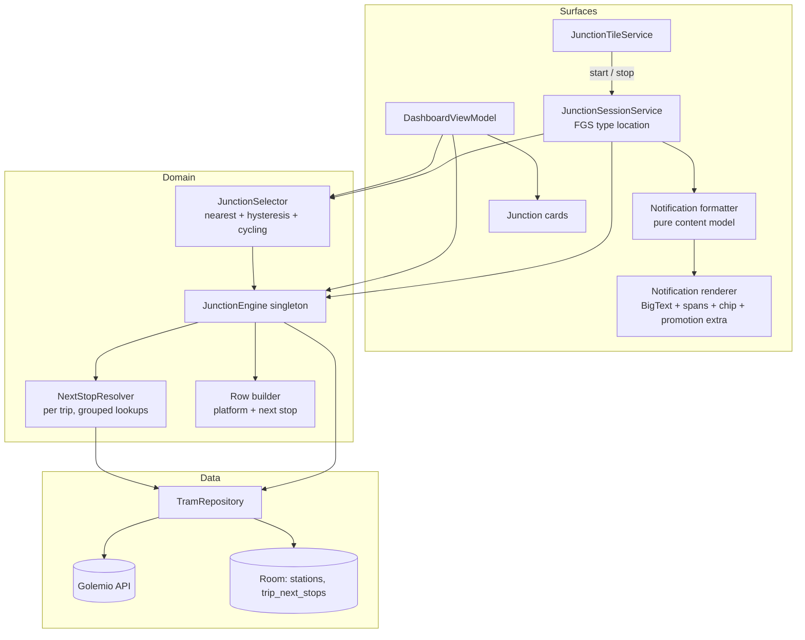
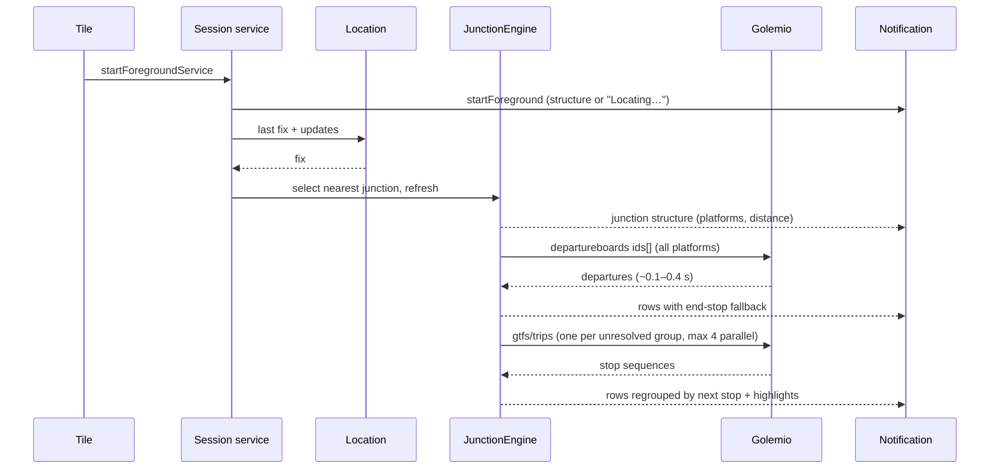
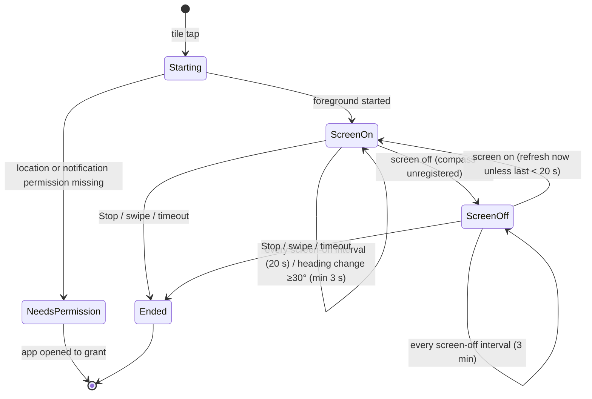
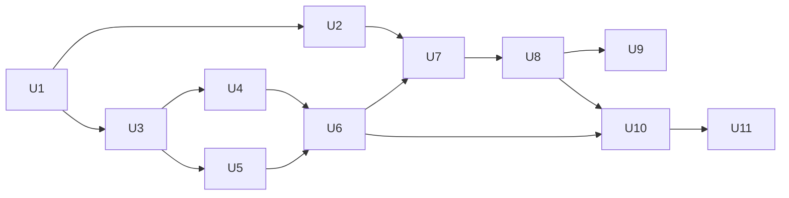

# Junction Glance Notification - Plan

## Goal Capsule

- **Objective:** See which trams are about to arrive at the nearest junction, in which direction and at which platform, within about 2 seconds and without opening the app.
- **Product authority:** Sole user and owner (brerez). Primary device is a Samsung Galaxy S22+ running One UI 8 / Android 16 (API 36). The S22+ does not receive One UI 8.5 (API 36.1), so API 36 is its ceiling.
- **Open blockers:** None block implementation. U2 is a decision gate: the owner confirms on the S22+ whether styled text survives in a promoted notification, which selects the styled-text renderer or the rich-layout fallback.
- **Execution profile:** Deep plan, 11 units. Build and JVM tests after every unit; emulator tests for UI units; a manual S22+ checklist for surfaces the emulator cannot show (Now Bar, Samsung battery behaviour).
- **Stop conditions:** Stop and ask the owner at the U2 gate, and whenever a change would alter a Product Contract requirement. Do not use any API 36.1 symbol.
- **Tail ownership:** The owner runs the on-device checklist and judges the battery success criterion over a few days.

> **Product Contract preservation:** Product Contract unchanged, except that Outstanding Questions now point to the Key Technical Decisions that resolve them.

---

## Product Contract

### Summary

A Quick Settings tile starts one live notification for the nearest tram junction. The notification has a styled-text row for each platform + next-stop pair, showing the next few trams and the platform's distance and compass direction. It is promoted to the status-bar chip and the Samsung Now Bar. The full app moves to the same junction/row model, fed by the same single batched request.

### Problem Frame

The owner uses the app while walking to a stop or waiting at one, on many different routes. Decisions happen in seconds: run for the line 8 arriving in 1 minute, or wait for the line 12 four minutes later. The app answers correctly but too slowly.

- **Opening it interrupts whatever app is in use.** A cold start takes 10–20 seconds before live times appear.
- **The delay is self-inflicted.** Most of it is the app's own pipeline, not the network: a 2 s location debounce, one request per platform with 500 ms spacing, a client-side throttle, and a serialized enrichment pass with a 150 ms delay per departure.
- **The widget failed.** An earlier home-screen widget was unreliable on the S22+.
- **Direction is hard to read at a junction.** Termini are poor cues: at Kamenická, platforms A and B each serve lines 1, 8, 12, 25 and 26, to ten different termini. At Hradčanská B, lines 1, 2 and 25 continue to Prašný most while 8, 18, 20 and 26 continue to Vítězné náměstí, so one platform serves two directions.
- **Routes change.** Reconstruction closures reroute lines every few months, so any fixed platform-to-direction mapping goes stale.

### Key Decisions

- **Destination-agnostic.** The feature never asks or infers where the owner is going. It shows the nearest junction's options, and the owner decides. "Towards home/work/school" survives only as a highlight on matching rows.
- **A row is a platform + next-stop pair, not a platform.** A platform whose lines diverge right after it becomes several rows. The platform's distance and direction show once, on its first row, because it is one place to stand.
- **Next stop is derived per trip, never cached per platform.** During a closure, a rerouted line moves to the correct row automatically. There is no stale platform label to invalidate.
- **Styled text rows, not a custom layout.** Android does not allow custom-layout notifications to be promoted. Styled text keeps a single notification that reaches the shade, the lock-screen card, the status-bar chip and the Now Bar. Fallback if styling is stripped on the S22+: a rich custom layout (coloured line badges, drawn arrow) that is not promoted.
- **One batched request per junction.** Verified on 2026-09-26 against the live API: several platform IDs in one departure-board request return correctly tagged departures in about 0.1–0.4 s. The request limit is shared across all IDs.
- **No stale departure times.** A cached departure list is usually empty or outdated by the time the owner looks again. On open, show the junction structure immediately; times appear when the fresh request returns.
- **Shared model for app and notification.** The dashboard adopts the same junction/row model and replaces the current station-card layout. The app is the expanded view: all rows, the live compass arrow, and more trams per row.

### Requirements

**Session and tile**

- R1. A Quick Settings tile starts and stops a junction session without launching the app.
- R2. Starting a session shows the notification with the junction structure right away. Live times fill in within about 2 seconds when location and network are available.
- R3. The session ends when the configured timeout expires, when the owner taps Stop, or when the owner swipes the notification away. Timeout choices include "Never", where only a swipe or Stop ends it.
- R4. Tapping the notification body opens the app on the same junction, already populated.
- R5. When the app lacks the battery exemption a long or "Never" session needs, it tells the owner and links to the setting instead of failing silently.

**Junction selection**

- R6. The notification shows the nearest junction and follows the owner as they move.
- R7. A "Next stop ›" action cycles through the 2nd and 3rd nearest junctions. The chosen junction stays until the owner cycles again or moves so that a different junction becomes the nearest.
- R8. When no tram stop is within walking range, the notification says so instead of showing a distant junction.

**Rows and content**

- R9. Each row shows the platform letter, the next stop, and the next few trams as line number and minutes. The platform's first row also shows its distance and direction.
- R10. Rows are ordered soonest tram first. The notification shows as many rows as fit (about 5). The rest collapse into "+N more directions", which opens the app.
- R11. Each tram shows its delay when it has one. Cancelled trams are marked as cancelled, and a tram at the platform shows as "now".
- R12. Line numbers and platform letters are visually emphasised (bold, and coloured if the device keeps colour) so line 8 vs line 12 is readable at a glance.
- R13. Until a trip's next stop is resolved, its row falls back to the tram's end stop. It moves to its next-stop row once resolved.
- R14. Rows whose trams pass the owner's home, work or school get a highlight. Highlighting never changes which rows appear or their order.

**Location and direction**

- R15. The direction arrow reflects the phone's compass heading. The compass is sampled only while the screen is on. The notification redraws only when the heading changes noticeably (about 30°), at most once every few seconds.
- R16. With the screen off, or without a compass reading, rows show distance only.

**Freshness and battery**

- R17. With the screen on, the session refreshes every 20 s. With the screen off, every 3 minutes. When the screen turns on, it refreshes immediately unless the last refresh was under 20 s ago.
- R18. The owner can configure the screen-on interval, the screen-off interval and the session timeout in the app's settings.
- R19. Every refresh of a junction is a single request covering all of that junction's platforms.

**Surfaces**

- R20. The notification appears in the notification shade and as a lock-screen card.
- R21. The notification is promoted as a live update. The status-bar chip shows the soonest tram, e.g. "8·1m". The Samsung Now Bar shows the junction and soonest tram.

**App dashboard**

- R22. The app dashboard shows junctions using the same platform + next-stop rows, fed by the same batched request and model as the notification.
- R23. Opening the app shows junction structure immediately and fills live times from one batched request, with no fixed delays between platforms.

### Acceptance Examples

- AE1. **Covers R9, R13.** Given the owner is at Hradčanská and platform B has departures for lines 2, 1, 25, 8, 18 and 26, when next stops are resolved, then platform B shows two rows: "→ Prašný most" with 2, 1, 25 and "→ Vítězné náměstí" with 8, 18, 26. Only the first row carries B's distance and arrow.
- AE2. **Covers R13, Key Decisions (per-trip next stop).** Given line 12 is diverted by a closure so that its next stop from Kamenická A changes, when the next refresh arrives, then line 12's trams appear in the row for the new next stop with no manual cache reset.
- AE3. **Covers R17.** Given the screen has been off for 2 minutes and the last refresh was 2 minutes ago, when the owner turns the screen on, then a refresh starts immediately. Given the last refresh was 10 s ago, then no extra refresh starts.
- AE4. **Covers R3.** Given the timeout is "Never", when 2 hours pass, then the session is still running. It ends only when the owner taps Stop or swipes the notification away.
- AE5. **Covers R7.** Given Kamenická is nearest and Strossmayerovo náměstí is second, when the owner taps "Next stop ›", then the notification shows Strossmayerovo náměstí. It keeps showing it while Kamenická remains the nearest junction.
- AE6. **Covers R10.** Given a hub has 8 platform + next-stop rows, when the notification renders, then it shows the rows with the soonest trams and a "+3 more directions" entry.
- AE7. **Covers R16.** Given the screen is off, when the lock-screen card or Now Bar is shown, then rows show distance without an arrow.

### Success Criteria

- From tapping the tile to live times in the notification takes about 2 s or less on the S22+ with GPS already warm.
- From opening the app to live times at the nearest junction takes about 2 s or less, down from 10–20 s today.
- At a junction the owner can tell which platform to walk to for a given direction without reading termini.
- A session left on "Never" all day doesn't noticeably change the S22+'s daily battery life compared with today's use. The owner's judgement over a few days is the test.

### Scope Boundaries

- Automatic session start (by geofence, time of day or activity) is deferred. The tile is the only trigger for now.
- Run/walk/wait recommendations are out. The owner decides from the displayed data.
- A home-screen widget is out.
- Two separate notifications (a rich one plus a promoted one-liner) are rejected.
- Vehicle-position tracking from the GTFS-RT feeds is deferred. The departure board's delay, last-stop and at-stop fields cover this version.

### Dependencies / Assumptions

- Live-update promotion requires raising `compileSdk` and `targetSdk` from 34 to 36. Targeting 36 also applies newer platform behaviour rules to the whole app, which is regression risk outside this feature.
- The S22+ runs One UI 8 and shows third-party live updates in the Now Bar. Assumed from public reporting; to be confirmed on the device.
- Coloured text spans survive in a promoted notification on One UI 8. Unverified; the first on-device test decides between styled text and the rich-layout fallback.
- The next stop for a trip can be resolved from the trip's stop sequence. Verified manually for Hradčanská B on 2026-09-26.
- A long-running session is expected to need a foreground service and the notification permission. Samsung may kill it unless battery use is set to Unrestricted.

### Outstanding Questions

All questions deferred to planning are resolved in the Planning Contract:

- Trams per row and look-ahead window: KTD8.
- Cheap next-stop resolution on a first visit: KTD5.
- Nearest-junction hysteresis: KTD4.
- Dashboard pieces on the junction/row layout: KTD10.
- Throttle and the line + headsign trip-sequence cache: KTD6.

### Sources / Research

- `app/src/main/java/com/example/tramapp/data/remote/GolemioService.kt`: departures take a single stop ID today; stop lookups already use `ids[]`.
- `app/src/main/java/com/example/tramapp/ui/DashboardViewModel.kt`: the 2 s location debounce, the 500 ms per-platform spacing, the 150 ms enrichment delay behind a mutex, and the refresh loops scoped to the view model.
- `app/src/main/java/com/example/tramapp/utils/ThrottleUtil.kt`: the 20 calls per 8 s client throttle.
- `app/src/main/java/com/example/tramapp/data/repository/TramRepository.kt`: the platform code is appended to the stop name; trip sequences are cached by line + headsign.
- `app/src/main/java/com/example/tramapp/domain/GetSmartDeparturesUseCase.kt`: the current home/work/school direction check.
- `app/build.gradle.kts`: `compileSdk` and `targetSdk` are 34.
- `docs/plans/2026-07-18-001-feat-dashboard-trust-rework-plan.md`: the dashboard state this plan partly replaces.
- `docs/ideation/2026-09-26-tram-glance-decisions-ideation.html`: the earlier ideation; its destination-based direction was superseded.
- Android 16 progress-centric notifications / Live Updates (developer.android.com): promotion is limited to standard, big-text, call and progress styles, with no custom views.
- Golemio PID departure board, live-tested 2026-09-26 at Kamenická, Strossmayerovo náměstí and Hradčanská.

---

## Planning Contract

### Key Technical Decisions

- KTD1. **Toolchain: smallest upgrade to API 36.** Raise `compileSdk` and `targetSdk` to 36 (not 36.1), AGP to 8.10 or later, and Gradle to 8.11.1 or later. Keep Kotlin 1.9.22 and androidx.core 1.12 unless the build fails; only then move to Kotlin 2.0.x with the Compose compiler Gradle plugin. Rationale: the S22+ ends at API 36, and the feature needs no androidx upgrade (KTD2).
- KTD2. **Promotion through the platform `Notification.Builder` and a string extra.** On API 36, `setRequestPromotedOngoing` and `EXTRA_REQUEST_PROMOTED_ONGOING` do not exist (both are 36.1). Request promotion by setting the `"android.requestPromotedOngoing"` boolean extra, which is the key androidx.core 1.17 writes. Use API 36 symbols directly behind `SDK_INT >= 36`: `setShortCriticalText`, `NotificationManager.canPostPromotedNotifications`, `Notification.hasPromotableCharacteristics` and `Settings.ACTION_APP_NOTIFICATION_PROMOTION_SETTINGS`.
- KTD3. **A junction is a PID stop node.** Group platforms by the node part of the stop ID (`U324Z1P` → `U324`), which the code already uses as `getBaseStopId`, instead of by the stop-name string. Store the node ID and `platform_code` on `StationEntity` instead of appending " [A]" to the name. A node is a tram junction when any of its platforms has tram departures (`isTram`, learned from the batched response).
- KTD4. **Nearest junction with hysteresis.** Distance to a junction is the distance to its nearest platform. Every fix updates displayed distances, but only fixes with accuracy of 50 m or better count toward switching junctions. Switch the selected junction only when a different junction is closer by at least 25 m and at least 15 %, on two consecutive accepted fixes. "Next stop ›" (R7) sets an override index into the 2nd and 3rd nearest; the override clears when the hysteresis-filtered nearest junction changes. Walking range for R8 is the existing `displayRadius` preference (default 750 m).
- KTD5. **Next stop resolved per trip, one lookup per group on first sight.** For departures whose trip is not yet resolved, group them by (platform, line, headsign). Fetch one representative trip's stop sequence (`gtfs/trips/{id}`, stop times on, shapes off), then assign the result to every trip ID in that group seen in the same response. Results are stored per trip ID and expire with the trip (24 h), never per platform. A diverted line gets new trip IDs and a new lookup, which satisfies AE2. At most 4 lookups run concurrently, and rows render with the end-stop fallback (R13) until they finish.
- KTD6. **Destination highlight comes from the same trip lookup.** The trip's downstream stop nodes are stored with its next stop. A row is highlighted (R14) when a home, work or school stop node from preferences is downstream. This replaces the `checkBounds` pipeline, its line + headsign `trip_routes` cache, the `line_directions` cache and the 150 ms enrichment delay. `ThrottleUtil` (20 calls per 8 s, 429 back-off) stays as a safety net in the OkHttp interceptor. All fixed inter-request delays go.
- KTD7. **One shared `JunctionEngine`.** A Hilt `@Singleton` owns junction structure, the batched refresh and row building. It exposes a `StateFlow` per junction. The notification service and the dashboard view model both read it, so R22 is structural. One refresh is one departure-board call with `ids[]` for all of the junction's platforms, `limit=200` and `minutesAfter=60` (R19). Refresh requests for the same junction within 5 s are coalesced; the API's CDN caches responses for 5 s anyway (`Cache-Control: s-maxage=5`, observed in the 2026-09-26 live test).
- KTD8. **Display budgets.** The notification shows up to 5 rows (R10) with 3 trams each. The app shows every row with up to 6 trams each. The look-ahead is 60 minutes for both, from the same response.
- KTD9. **Content model separate from rendering.** A pure Kotlin formatter turns a junction snapshot plus heading, screen state and time into a notification content model: title, styled segments per line, chip text and overflow count. A thin Android renderer turns it into spans and a notification. The U2 outcome only affects the renderer and a "colour allowed" flag. The rich-layout fallback would be a second renderer.
- KTD10. **Dashboard mapping.** The app shows the nearest `maxStations` junctions (default 4), nearest first and expanded. Every row shows a live compass arrow while the app is visible. Kept: the collapsible map (with junction platform markers), per-tram amenity glyphs, the tram tap → route popup, and the status indicator (now fed by the engine's fetch time). Favourite lines become a star on the line badge only; they no longer reorder rows, because rows stay soonest-first (R10, R14). The cached-departures display is removed ("No stale departure times").
- KTD11. **Session is a location-type foreground service started from the tile.** A tile tap counts as user-initiated, so it may start a foreground service on Android 14–16. The `location` service type has no 6-hour timeout, which makes "Never" viable. While-in-use location permission is enough. When location or notification permission is missing, the tile opens the app (`startActivityAndCollapse(PendingIntent)`) to ask for it.
- KTD12. **Cadence is a pure state machine.** A `SessionScheduler` decides when to refresh from screen state, last refresh time and settings: 20 s screen-on, 3 min screen-off, immediate on screen-on unless the last refresh was under 20 s ago (R17). A `HeadingGate` decides compass redraws: at least a 30° change and at least 3 s since the last redraw (R15). Both are unit-tested without Android.

### High-Level Technical Design

Components and data flow. The engine is the only place that calls the departure board; both surfaces are readers.

Tile tap to live notification. The structure renders first; times follow within one round trip; next-stop lookups patch rows in place.

Session lifecycle and cadence.

### Assumptions

- ~~Samsung One UI 8 promotes a notification that carries the `"android.requestPromotedOngoing"` extra on API 36.~~ **U2 outcome (2026-09-26, S22+ SM-S906E, One UI 8, API 36.0, checked over adb):** the plain BigText spike has `hasPromotableCharacteristics() == true` (false when colorized), but `canPostPromotedNotifications()` is false, the device has no `ACTION_APP_NOTIFICATION_PROMOTION_SETTINGS` activity, `FLAG_PROMOTED_ONGOING` is never set, no status-bar chip appears, and the Now Bar is a Samsung per-package allowlist (`key_now_bar_<package>`). Bold and colour spans are stripped in the shade. **Owner decision:** ship the rich custom-layout renderer (coloured line badges, drawn arrows), not promoted. R21 (chip, Now Bar) is blocked by the device; R12 is met by the layout. The emulator (API 36.0 image) cannot promote either and wrongly reports promotable only when colorized.
- Trips in the same (platform, line, headsign) group in one response share a next stop. A diversion that keeps the same headsign for some trips but not others would show those trips in one row until each is looked up.
- ~~The existing `Samsung_Galaxy_S22` AVD is below API 36.~~ It already runs the API 36 `google_apis` image and serves as the API 36 AVD; the Now Bar exists only on the real device.
- The default session timeout is 1 hour. The brainstorm lists the choices but no default.

### Sequencing

U1 lands first because every later unit compiles against API 36. U2 can run in parallel with U3–U6, but U7's renderer waits for its result. U11 runs last, once nothing reads the old pipeline.

---

## Implementation Units

### U1. Toolchain to API 36 and edge-to-edge

- **Goal:** Build and run the app unchanged at `compileSdk` and `targetSdk` 36.
- **Requirements:** Dependencies/Assumptions (SDK 36), KTD1.
- **Dependencies:** None.
- **Files:** `build.gradle.kts`, `gradle/wrapper/gradle-wrapper.properties`, `app/build.gradle.kts`, `app/src/main/java/com/example/tramapp/MainActivity.kt`, `app/src/main/java/com/example/tramapp/ui/DashboardScreen.kt`, `app/src/main/java/com/example/tramapp/ui/SettingsScreen.kt`, `app/src/main/java/com/example/tramapp/ui/MapPickerScreen.kt`, `docs/verification-harness.md`.
- **Approach:** Install the `platforms;android-36` SDK package; only 36.1 is installed locally. Bump AGP, Gradle and the SDK levels together. Keep Kotlin 1.9.22 unless compilation fails (KTD1). Targeting 36 removes the edge-to-edge opt-out, so call `enableEdgeToEdge()` and make the scaffold, header, map and bottom navigation respect system-bar insets. Check that no `onBackPressed` override exists; predictive back ignores it at 36. Add an API 36 AVD to the harness doc.
- **Execution note:** Strong `/consider-offload-agy` candidate: dependency and toolchain trial-and-error in its own file set.
- **Patterns to follow:** `docs/verification-harness.md` for commands.
- **Test scenarios:**
  - The full existing JVM suite passes with no test changes.
  - `DashboardTrustFlowTest` passes on the API 36 AVD.
  - On the API 36 AVD, the header and the first station card are not under the status bar, and the bottom navigation is not under the gesture bar (screenshot).
- **Verification:** A clean build at API 36, green JVM and instrumented suites, and a screenshot showing correct insets.

### U2. Promotion spike on the S22+ (decision gate)

- **Goal:** Decide between the styled-text renderer and the rich-layout fallback, and confirm that the S22+ promotes the notification.
- **Requirements:** R12, R20, R21; the Key Decision on styled text; KTD2.
- **Dependencies:** U1.
- **Files:** `app/src/debug/java/com/example/tramapp/debug/PromotionSpikeActivity.kt`, `app/src/debug/AndroidManifest.xml`, `docs/plans/2026-09-26-001-feat-junction-glance-notification-plan.md` (record the outcome under Assumptions).
- **Approach:** A debug-only screen posts one hard-coded notification shaped like the real one: `BigTextStyle` text with bold and coloured line numbers, short critical text "8·1m", the promotion extra, ongoing, not colorized. It shows `canPostPromotedNotifications()` and `hasPromotableCharacteristics()` and, after posting, whether `FLAG_PROMOTED_ONGOING` was set. The owner installs the build on the S22+ and records what the shade, lock screen, status-bar chip and Now Bar show, including whether bold and colour survive.
- **Execution note:** Stop and ask the owner for the observation. The agent cannot see the Now Bar.
- **Test scenarios:**
  - On the API 36 AVD, the spike notification reports `hasPromotableCharacteristics() == true` and a status-bar chip reading "8·1m".
  - Owner check on the S22+: the chip shows, the Now Bar shows the notification, and bold and colour on line numbers are recorded as kept or stripped.
- **Verification:** The outcome is written into this plan's Assumptions, and the renderer choice for U7 is fixed.

### U3. Batched departure board and richer departure model

- **Goal:** Fetch all of a junction's platforms in one request and expose delay, cancellation, at-stop and platform fields.
- **Requirements:** R11, R19, R23; KTD7.
- **Dependencies:** U1.
- **Files:** `app/src/main/java/com/example/tramapp/data/remote/GolemioService.kt`, `app/src/main/java/com/example/tramapp/data/remote/GolemioModels.kt`, `app/src/main/java/com/example/tramapp/data/repository/TramRepository.kt`, `app/src/main/java/com/example/tramapp/data/local/entity/Entities.kt`, `app/src/main/java/com/example/tramapp/data/local/TramDatabase.kt`, `app/src/test/java/com/example/tramapp/data/repository/TramRepositoryBatchTest.kt`, `app/src/test/java/com/example/tramapp/data/remote/GolemioBatchProbeTest.kt`.
- **Approach:** Add a departure-board call taking `ids[]`, with `limit` and `minutesAfter` parameters. Add nullable model fields: `delay.minutes`, `delay.is_available`, `trip.is_canceled`, `trip.is_at_stop`, `stop.platform_code` and `last_stop`. The repository returns departures grouped by platform stop ID, keeps tram departures only and updates `isTram` per platform. Add `nodeId` and `platformCode` columns to `StationEntity` and fill them when stops are discovered (KTD3). Bump the DB version; the destructive migration is acceptable because stations are re-fetched. Stop writing the departure cache (removed in U11).
- **Patterns to follow:** `GolemioAmenityProbeTest` for a live-API probe that reads `local.properties`; MockWebServer for repository tests.
- **Test scenarios:**
  - A MockWebServer response with 6 platforms returns departures keyed to the right platform IDs, and the request carries every ID as `ids[]`.
  - Departures with `route.type != 0` are dropped; a platform with only buses gets `isTram = false`, and a platform with a tram gets `isTram = true`.
  - Missing `delay`, `is_canceled` and `is_at_stop` parse as null or false without crashing.
  - A 429 triggers the existing throttle back-off and one retry.
  - Live probe, skipped without an API key: one call for Kamenická A/B and Strossmayerovo náměstí A–D returns departures for at least 4 platforms, each tagged with a platform code.
- **Verification:** Batch tests are green, and the live probe prints per-platform counts.

### U4. Junction discovery and nearest-junction selection

- **Goal:** Turn nearby stops into junctions and pick the displayed one with hysteresis, cycling and a walking-range check.
- **Requirements:** R6, R7, R8; AE5; KTD3, KTD4.
- **Dependencies:** U3.
- **Files:** `app/src/main/java/com/example/tramapp/domain/junction/Junction.kt`, `app/src/main/java/com/example/tramapp/domain/junction/JunctionSelector.kt`, `app/src/main/java/com/example/tramapp/domain/junction/JunctionDirectory.kt`, `app/src/main/java/com/example/tramapp/domain/junction/Geo.kt`, `app/src/test/java/com/example/tramapp/domain/junction/JunctionSelectorTest.kt`, `app/src/test/java/com/example/tramapp/domain/junction/JunctionDirectoryTest.kt`.
- **Approach:** `JunctionDirectory` builds junctions from cached `StationEntity` rows grouped by node: name, platforms with letter, position and tram flag. It re-runs stop discovery only after moving more than 300 m from the last discovery point or when the cache is older than 24 h. `JunctionSelector` is a pure state holder: it takes fixes (position and accuracy), returns the ranked junctions within walking range and the selected one, and handles the "Next stop ›" override (KTD4). `Geo` holds distance, bearing and the arrow quantisation shared by the notification and the app.
- **Test scenarios:**
  - Covers AE5. With Kamenická nearest and Strossmayerovo náměstí second, cycling once selects Strossmayerovo; further fixes with Kamenická still nearest keep Strossmayerovo; a fix that makes a third junction nearest clears the override.
  - Cycling past the 3rd nearest wraps back to the nearest.
  - Jitter: alternating fixes 10 m apart between two junctions 40 m apart never switch the selection.
  - A junction closer by 30 m and 20 % on two consecutive fixes becomes selected; on a single fix it does not.
  - A fix with 120 m accuracy is ignored.
  - With no tram platform within 750 m, the selector reports "no stop in range" instead of the nearest distant junction (R8).
  - Platforms `U324Z1P` and `U324Z2P` group into one junction; a bus-only platform is excluded from tram rows.
  - Bearing from a point to a platform due north-east quantises to the ↗ arrow.
- **Verification:** Selector and directory tests are green.

### U5. Per-trip next stop and destination resolver

- **Goal:** Resolve each trip's next stop after the platform and its downstream destinations, cheaply and without stale platform labels.
- **Requirements:** R9, R13, R14; AE1, AE2; KTD5, KTD6.
- **Dependencies:** U3.
- **Files:** `app/src/main/java/com/example/tramapp/domain/junction/NextStopResolver.kt`, `app/src/main/java/com/example/tramapp/data/local/entity/TripNextStopEntity.kt`, `app/src/main/java/com/example/tramapp/data/local/dao/TripNextStopDao.kt`, `app/src/main/java/com/example/tramapp/data/local/TramDatabase.kt`, `app/src/main/java/com/example/tramapp/di/DatabaseModule.kt`, `app/src/main/java/com/example/tramapp/data/repository/TramRepository.kt`, `app/src/test/java/com/example/tramapp/domain/junction/NextStopResolverTest.kt`, `app/src/test/java/com/example/tramapp/domain/junction/NextStopProbeTest.kt`.
- **Approach:** Store (trip ID, platform stop ID) → next stop ID, next stop name, downstream node IDs and fetch time, with a 24 h expiry. For unresolved trips, group them as in KTD5, fetch one representative trip (shapes off) and find the platform in its stop times, by exact stop ID first and node ID second. The next stop is the following entry. Take names from the trip response, then the station cache, then one batched `gtfs/stops ids[]` call. Write the result for every trip ID in the group. When the platform is not in the sequence or the fetch fails, leave the trips unresolved; they keep the end-stop fallback and retry on a later refresh.
- **Patterns to follow:** The in-flight de-duplication in `TramRepository.getTripSequence` (a `Deferred` per key behind a `Mutex`), keyed by trip instead of line + headsign.
- **Test scenarios:**
  - Covers AE1. Hradčanská B departures for lines 2, 1, 25 (next stop Prašný most) and 8, 18, 26 (next stop Vítězné náměstí) resolve to those two next stops.
  - Six departures in 2 groups trigger exactly 2 trip fetches; a second resolve call for the same trips triggers none.
  - Covers AE2. Line 12 trips with new IDs whose sequence has a different next stop resolve to the new stop, while older cached trips keep theirs.
  - The platform is last in the sequence (terminus): no next stop, and the trip stays in fallback.
  - The trip fetch fails: trips stay unresolved, and no failure is cached for longer than one refresh.
  - A home stop node downstream of the platform marks the trip home-bound; a home stop upstream does not.
  - With at most 4 concurrent fetches, 10 groups never have more than 4 requests in flight.
- **Verification:** Resolver tests are green. A live probe, skipped without an API key, resolves next stops at Hradčanská, Kamenická and Strossmayerovo náměstí and reports any platform whose ID is not found in its trips' stop sequences.

### U6. JunctionEngine and row building

- **Goal:** One shared source of junction snapshots (structure, rows, freshness) for both surfaces.
- **Requirements:** R2, R9, R10, R11, R13, R14, R19, R22, R23; AE1, AE6; KTD7, KTD8.
- **Dependencies:** U4, U5.
- **Files:** `app/src/main/java/com/example/tramapp/domain/junction/JunctionEngine.kt`, `app/src/main/java/com/example/tramapp/domain/junction/JunctionSnapshot.kt`, `app/src/main/java/com/example/tramapp/domain/junction/JunctionRowBuilder.kt`, `app/src/test/java/com/example/tramapp/domain/junction/JunctionRowBuilderTest.kt`, `app/src/test/java/com/example/tramapp/domain/junction/JunctionEngineTest.kt`.
- **Approach:**
  - A snapshot holds: junction structure (always), rows (null until the first fetch), fetch time, and a state of locating, no stop in range, loading, live or error.
  - `refresh(junctionId)` emits the structure immediately, then makes one batched call and emits rows using the end-stop fallback. It then runs the resolver and re-emits with rows regrouped by next stop and highlights applied.
  - `JunctionRowBuilder` is a pure function. It groups departures by (platform, next stop or fallback end stop) and computes minutes from the predicted, else scheduled, time. A trip at the stop, or at 0 minutes or less, shows as "now".
  - Rows are ordered by their soonest non-cancelled tram. Rows with only cancelled trams go last.
  - The platform's distance and bearing go on that platform's first row in the final order.
  - Highlights never change inclusion or order.
  - Per-junction mutex and 5 s coalescing (KTD7).
- **Execution note:** Write the row-builder tests first; the ordering and first-row rules are the core of the feature.
- **Test scenarios:**
  - Covers AE1. Platform B with trips resolved to two next stops produces two rows; only the first carries distance and bearing.
  - Covers AE6. 8 rows are all present in the snapshot, ordered by soonest tram; trimming to 5 is the formatter's job.
  - A cancelled tram is marked cancelled and does not set its row's sort time.
  - A trip with `is_at_stop` shows "now"; a delay of 3 minutes is carried as +3.
  - Covers R14. Adding a home-bound flag to one row changes neither the row set nor the order.
  - An unresolved trip sits in a row labelled with its end stop and moves to its next-stop row after resolution (R13).
  - Engine: `refresh` emits structure before rows. Two refresh calls within 5 s cause one network call. A network failure keeps the previous rows, marks the error with a fetch time, and never shows departure times older than the last successful fetch.
  - Engine: one refresh of a 6-platform junction issues exactly one departure-board call (R19).
- **Verification:** Engine and row-builder tests are green.

### U7. Notification content model and renderer

- **Goal:** Render a junction snapshot as the promoted notification.
- **Requirements:** R9, R10, R11, R12, R14, R16, R20, R21; AE6, AE7; KTD2, KTD8, KTD9.
- **Dependencies:** U2, U6.
- **Files:** `app/src/main/java/com/example/tramapp/glance/JunctionNotificationFormatter.kt`, `app/src/main/java/com/example/tramapp/glance/NotificationContent.kt`, `app/src/main/java/com/example/tramapp/glance/JunctionNotificationRenderer.kt`, `app/src/test/java/com/example/tramapp/glance/JunctionNotificationFormatterTest.kt`, `app/src/androidTest/java/com/example/tramapp/glance/JunctionNotificationRendererTest.kt`.
- **Approach:**
  - **Formatter output (pure):**
    - Title: the junction name.
    - One line per row, as styled segments: platform letter, arrow (omitted when there is no heading or the screen is off), distance, "→ next stop", and up to 3 trams (line, minutes, delay, cancelled, now).
    - A "+N more directions" line when there are more than 5 rows.
    - Chip text for the soonest tram (≤7 characters, e.g. "8·1m").
    - A Now Bar summary.
    - A status line for each non-live state: locating, no stop in range, times still loading, or data stale.
    - Highlighted rows (R14) get a leading "●" and a bold next-stop label; this must stay distinct from the app's favourite-line star, which the notification does not show.
  - **Renderer:**
    - Silent channel at default importance: it must not be MIN.
    - `BigTextStyle`, ongoing, not colorized, `setOnlyAlertOnce`.
    - Short critical text, and the promotion extra on API 36.
    - Bold spans on line numbers and platform letters. Colour spans only if U2 kept colour.
    - Actions "Next stop ›" and "Stop". A content intent opens the app with the junction ID (R4). A delete intent ends the session.
    - The "+N more" line is text only; tapping the body opens the app.
- **Test scenarios:**
  - Covers AE6. 8 rows produce 5 row lines and "+3 more directions".
  - Covers AE7. Screen off or no heading: lines carry distance but no arrow glyph.
  - Chip text for line 8 in 1 minute is "8·1m"; a tram at the stop gives "8·now"; the chip never exceeds 7 characters.
  - Cancelled trams render with a cancelled marker; delays render as "+3".
  - Line numbers and platform letters are emitted as emphasised segments (R12).
  - No stop within range yields the "no tram stop nearby" status and no rows (R8).
  - Instrumented: the rendered notification has the promotion extra, is ongoing, is not colorized, has no custom view, and `hasPromotableCharacteristics()` is true on API 36.
- **Verification:** Formatter tests green; renderer test green on the API 36 AVD.

### U8. Session service, tile, cadence, location and compass

- **Goal:** A tile-started session that keeps the notification live on the configured cadence and follows the owner.
- **Requirements:** R1, R2, R3, R6, R7, R15, R16, R17, R19, R20, R21; AE3, AE4, AE5, AE7; KTD4, KTD11, KTD12.
- **Dependencies:** U7.
- **Files:** `app/src/main/java/com/example/tramapp/glance/JunctionSessionService.kt`, `app/src/main/java/com/example/tramapp/glance/JunctionTileService.kt`, `app/src/main/java/com/example/tramapp/glance/SessionScheduler.kt`, `app/src/main/java/com/example/tramapp/glance/HeadingGate.kt`, `app/src/main/java/com/example/tramapp/glance/CompassSampler.kt`, `app/src/main/java/com/example/tramapp/glance/SessionState.kt`, `app/src/main/AndroidManifest.xml`, `app/src/main/res/drawable/ic_tile_tram.xml`, `app/src/test/java/com/example/tramapp/glance/SessionSchedulerTest.kt`, `app/src/test/java/com/example/tramapp/glance/HeadingGateTest.kt`, `app/src/androidTest/java/com/example/tramapp/glance/JunctionSessionServiceTest.kt`.
- **Approach:**
  - **Tile:** an active tile whose state mirrors a process-wide `SessionState` flow. A tap starts or stops the service. With a permission missing, a tap opens the app instead (KTD11).
  - **Start-up:** the service calls `startForeground` at once with the formatter's output for the current snapshot, which is the locating state until the first fix. It seeds from the last known fix, requests fused location updates: high accuracy every 10 s with the screen on (so fixes meet the 50 m switching bar while walking), balanced priority every 60 s with the screen off, 25 m minimum displacement, feeds fixes to `JunctionSelector` and asks the engine to refresh the selected junction.
  - **Screen state:** a receiver for screen on/off drives `SessionScheduler`, starting and stopping `CompassSampler` (rotation-vector sensor) and switching location intervals.
  - **Redraws:** `HeadingGate` limits compass redraws. All notification updates are capped at one per 3 s.
  - **Ending:** Stop, swipe (delete intent) and timeout all end the session: stop updates, unregister sensors, stop the foreground service and update the tile. "Never" sets no timer.
  - **Manifest:** `FOREGROUND_SERVICE`, `FOREGROUND_SERVICE_LOCATION`, `POST_NOTIFICATIONS`, the service with `foregroundServiceType="location"`, and the tile service with `BIND_QUICK_SETTINGS_TILE` and active-tile metadata.
  - **Timing:** log the elapsed time from tile tap to the first live render, for the success criterion.
- **Test scenarios:**
  - Covers AE3. Screen off for 2 minutes with the last refresh 2 minutes ago: turning the screen on schedules an immediate refresh. With the last refresh 10 s ago, it does not.
  - Screen on: the next refresh is 20 s after the last one. Screen off: 3 minutes. Custom intervals from settings are honoured.
  - Covers AE4. With timeout "Never", the scheduler never emits a stop after 2 simulated hours. With a 30-minute timeout, it emits a stop at 30 minutes.
  - `HeadingGate`: a 20° change does not redraw; a 35° change redraws; two 35° changes 1 s apart redraw once.
  - Covers AE7. Screen off: the compass is stopped and the next render has no arrow.
  - Instrumented: starting the service posts the ongoing notification with the location service type; "Stop" and the delete intent stop the service and set `SessionState` to inactive.
  - Instrumented: "Next stop ›" moves the notification title to the second-nearest junction (fake location on the emulator).
- **Verification:** JVM tests green; instrumented service test green on the API 36 AVD; the owner checklist (tile to live times ≤2 s, Now Bar, lock screen) passes on the S22+.

### U9. Session settings and battery and promotion guidance

- **Goal:** Let the owner configure cadence and timeout, and show clear guidance when the phone would kill or demote the session.
- **Requirements:** R5, R18; KTD2, KTD11.
- **Dependencies:** U8.
- **Files:** `app/src/main/java/com/example/tramapp/data/local/datastore/UserPreferencesManager.kt`, `app/src/main/java/com/example/tramapp/ui/SettingsScreen.kt`, `app/src/main/java/com/example/tramapp/ui/SettingsViewModel.kt`, `app/src/main/java/com/example/tramapp/glance/SessionHealth.kt`, `app/src/main/AndroidManifest.xml`, `app/src/test/java/com/example/tramapp/glance/SessionHealthTest.kt`.
- **Approach:**
  - **New preferences:** screen-on interval (10, 20, 30 or 60 s; default 20), screen-off interval (1, 3, 5 or 10 min; default 3), and session timeout (15 min, 30 min, 1 h, 2 h or Never; default 1 h).
  - **`SessionHealth`** is a pure check over three inputs: battery exemption (`isIgnoringBatteryOptimizations`), promotion allowed (`canPostPromotedNotifications`) and the timeout. It returns what to warn about.
  - **Battery warning:** timeouts of 2 h or "Never" without the exemption show a line in the notification and a card in Settings. The card links to `ACTION_REQUEST_IGNORE_BATTERY_OPTIMIZATIONS`, plus a one-line hint to set the app to Unrestricted in Samsung battery settings.
  - **Promotion warning:** disabled promotion links to `ACTION_APP_NOTIFICATION_PROMOTION_SETTINGS`.
  - **Manifest:** add `REQUEST_IGNORE_BATTERY_OPTIMIZATIONS`.
- **Test scenarios:**
  - Timeout "Never" without the exemption warns; with the exemption it does not.
  - A 2 h timeout without the exemption warns; 15 min, 30 min and 1 h timeouts do not.
  - Promotion disabled warns with the promotion-settings target.
  - New preferences default to 20 s, 3 min and 1 h, and round-trip through DataStore.
- **Verification:** Tests green; the Settings screen shows the new controls on the emulator.

### U10. Dashboard on the junction model

- **Goal:** The app becomes the expanded view of the same junction model, with live times in about 2 s from open.
- **Requirements:** R4, R22, R23; KTD7, KTD8, KTD10.
- **Dependencies:** U6, U8.
- **Files:** `app/src/main/java/com/example/tramapp/ui/DashboardViewModel.kt`, `app/src/main/java/com/example/tramapp/ui/DashboardScreen.kt`, `app/src/main/java/com/example/tramapp/ui/components/JunctionCard.kt`, `app/src/main/java/com/example/tramapp/ui/components/JunctionRowView.kt`, `app/src/main/java/com/example/tramapp/ui/components/TramRow.kt`, `app/src/main/java/com/example/tramapp/ui/components/CompassArrow.kt`, `app/src/main/java/com/example/tramapp/MainActivity.kt`, `app/src/test/java/com/example/tramapp/ui/DashboardViewModelJunctionTest.kt`, `app/src/androidTest/java/com/example/tramapp/JunctionDashboardFlowTest.kt`.
- **Approach:**
  - **View model:**
    - Feed the first location fix to `JunctionSelector` with no debounce.
    - Take the nearest `maxStations` junctions and refresh them concurrently through the engine, one batched call each.
    - Collect their snapshots and refresh every 20 s while the app is visible.
    - An intent junction ID from the notification puts that junction first and expanded (R4).
  - **Screen:**
    - Junction cards replace station group cards. Rows show the platform letter, a live compass arrow (sensor collected while the screen is composed), distance, next stop, and up to 6 trams using the existing `TramRow`.
    - Kept from before: amenity glyphs, the favourite star, and the tram tap → route popup.
    - The map stays collapsible and shows junction platform markers.
  - **Status and permissions:**
    - The status indicator shows the engine's fetch time.
    - `MainActivity` requests `POST_NOTIFICATIONS` alongside location, and handles the tile's permission-request intent.
- **Patterns to follow:** The `autoRefreshEnabled` test seam and `runCurrent()`-based view-model tests in `DashboardViewModelStateTest.kt`; the test-tag vocabulary in `docs/verification-harness.md`.
- **Test scenarios:**
  - Open with cached stations: junction structure is emitted before any network call completes, and no cached departure times appear.
  - The first location fix triggers engine refreshes with no 2 s debounce and no inter-request delay; 4 junctions cause exactly 4 departure-board calls.
  - Covers R4. An intent with the Kamenická junction ID places Kamenická first and expanded.
  - Favourite lines show a star and do not reorder rows.
  - Instrumented: the dashboard shows a junction card with platform rows and next-stop labels (fake location near Kamenická), and a screenshot is captured.
- **Verification:** View-model and instrumented tests green on the API 36 AVD; owner check that cold open to live times is ≤2 s on the S22+.

### U11. Retire the per-platform pipeline

- **Goal:** Remove code the junction model replaced, so there is one fetch path.
- **Requirements:** R19, R22, R23; KTD6.
- **Dependencies:** U10.
- **Files:** `app/src/main/java/com/example/tramapp/domain/GetSmartDeparturesUseCase.kt`, `app/src/main/java/com/example/tramapp/data/repository/TramRepository.kt`, `app/src/main/java/com/example/tramapp/data/local/dao/LineDirectionDao.kt`, `app/src/main/java/com/example/tramapp/data/local/entity/LineDirectionEntity.kt`, `app/src/main/java/com/example/tramapp/data/local/dao/DepartureDao.kt`, `app/src/main/java/com/example/tramapp/data/local/entity/DepartureEntity.kt`, `app/src/main/java/com/example/tramapp/data/local/dao/TripRouteDao.kt`, `app/src/main/java/com/example/tramapp/data/local/entity/Entities.kt` (`TripRouteEntity`), `app/src/main/java/com/example/tramapp/data/local/TramDatabase.kt`, `app/src/main/java/com/example/tramapp/di/DatabaseModule.kt`, `app/src/main/java/com/example/tramapp/ui/StationUiState.kt`, `app/src/main/java/com/example/tramapp/ui/components/StationGroupCard.kt`, `app/src/test/java/com/example/tramapp/ui/DashboardViewModelStateTest.kt`, `app/src/test/java/com/example/tramapp/ui/DashboardViewModelFetchOrderTest.kt`, `app/src/test/java/com/example/tramapp/domain/GetSmartDeparturesUseCaseTest.kt`.
- **Approach:**
  - **Remove:** `checkBounds` and the bound-check use case surface; `getTripSequence` and the `trip_routes` line + headsign cache; the `line_directions` table; the departure cache table and `getCachedDepartures`; their DAO providers in `DatabaseModule` and the matching `TramRepository` constructor parameters; per-platform `StationUiState`/`StationRow`; and `StationGroupCard`.
  - **Tests:** delete or rewrite tests that only covered removed behaviour. Keep `ThrottleUtil` and its tests.
  - **Keep:** `DestinationLineCacheUseCase`, which still supplies home, work and school stop IDs.
- **Test scenarios:**
  - Test expectation: no new behaviour. The full JVM and instrumented suites stay green after removal, and a search finds no remaining references to the removed symbols.
- **Verification:** Build and all suites green; the only departure-board call sites are in the engine path.

---

## Verification Contract

| Gate | Command or check | Applies to |
|---|---|---|
| JVM tests | `./gradlew :app:testDebugUnitTest --rerun-tasks` | Every unit |
| API floor | Build at `compileSdk 36`; any API 36.1 symbol fails compilation | U1 onward |
| Instrumented tests | `./gradlew :app:connectedDebugAndroidTest` on an API 36 AVD, screenshots per `docs/verification-harness.md` | U1, U7, U8, U10, U11 |
| Live API probe | `GolemioBatchProbeTest` with `GOLEMIO_API_KEY` in `local.properties` | U3 |
| Owner gate | U2 observation recorded in Assumptions | U2, before U7 |
| S22+ checklist | Tile to live times ≤2 s (timing log); chip shows the soonest tram; Now Bar shows the junction; lock-screen card shows rows; "Next stop ›" cycles; swipe and Stop end the session; cold app open to live times ≤2 s | U8, U10 |
| Rate discipline | One departure-board call per junction refresh; `ThrottleUtil` tests green | U6, U10 |

## Definition of Done

- R1–R23 are met, with AE1–AE7 each covered by a named test or a checklist item.
- The app builds at compileSdk and targetSdk 36 with no API 36.1 symbol, and the existing features (map, route popup, amenity glyphs, settings, map picker) still work under edge-to-edge.
- The U2 outcome is recorded, and the shipped renderer matches it.
- The S22+ checklist passes, observed by the owner.
- Every junction refresh is one batched request, and no fixed inter-request delays remain.
- The old per-platform pipeline is removed, and code from abandoned attempts (including the U2 spike if not kept as a debug tool) is gone.
- JVM and instrumented suites are green.

---

## Risks & Dependencies

| Risk | Mitigation |
|---|---|
| One UI 8 ignores the string promotion extra on API 36 | U2 checks this before any renderer work. If there is no promotion, the notification still works in the shade and on the lock screen; R21 is then reported to the owner as blocked by the device. |
| Styled text stripped on the S22+ | KTD9 limits the change to the renderer: a rich custom layout, not promoted, per the brainstorm fallback. |
| Kotlin 1.9 cannot build against SDK 36 | U1's fallback path: Kotlin 2.0.x with the Compose compiler plugin, and KSP and Hilt versions to match. |
| targetSdk 36 regressions (edge-to-edge, predictive back) | Handled in U1 before feature work, verified with screenshots on an API 36 AVD. |
| Samsung kills the service despite the foreground state | U9 guidance to set Unrestricted; the owner judges battery and reliability over a few days. |
| Group inheritance mislabels a partial diversion with an unchanged headsign | Accepted (see Assumptions): each new trip ID is still looked up on first sight within its refresh group. |
| Golemio `limit` is shared across `ids[]` | `limit=200` with a 60-minute window; the probe checks per-platform coverage at a large hub. |

## Deferred to Follow-Up Work

- Automatic session start (geofence, time, activity), which the brainstorm deferred.
- Vehicle-position tracking from GTFS-RT.
- Reducing `HttpLoggingInterceptor` from `BODY` in release builds.
- Removing stray files (`DashboardScreen.kt.orig`, phase summary notes in `ui/components/`).

## Sources & Research (planning)

- Android API levels from the local SDK database `platforms/android-36.1/data/api-versions.xml`:
  - At 36: `setShortCriticalText`, `canPostPromotedNotifications`, `hasPromotableCharacteristics`, `FLAG_PROMOTED_ONGOING`, `ProgressStyle`, `ACTION_APP_NOTIFICATION_PROMOTION_SETTINGS`.
  - At 36.1: `setRequestPromotedOngoing`, `EXTRA_REQUEST_PROMOTED_ONGOING`, `POST_PROMOTED_NOTIFICATIONS`.
- Galaxy S22 series ends on One UI 8 (Android 16) and is excluded from One UI 8.5 (Android 16 QPR2): androidheadlines.com (June 2026), sammyguru.com (June 2026 update).
- One UI 8 stable shows third-party Live Updates in the Now Bar: androidauthority.com, 9to5google.com (2025-07-09).
- Live update eligibility rules (ongoing, content title, not colorized, no custom views, not a group summary, channel not MIN): developer.android.com, "Create live update notifications".
- AGP 8.10 is the minimum for API 36, with Gradle 8.11.1: developer.android.com AGP 8.10 release notes. androidx.core 1.16 or later needs Kotlin 2.x consumers.
- A tile tap is a user-initiated foreground-service start; the `location` type has no 6-hour timeout: developer.android.com, foreground-service restrictions and timeouts.
- Samsung battery behaviour and the Unrestricted setting: dontkillmyapp.com/samsung.
- Existing code this plan replaces: `app/src/main/java/com/example/tramapp/ui/DashboardViewModel.kt` (debounce, 500 ms and 300 ms spacing, enrichment mutex), `app/src/main/java/com/example/tramapp/domain/GetSmartDeparturesUseCase.kt` (`checkBounds`, `getBaseStopId`), and `app/src/main/java/com/example/tramapp/data/repository/TramRepository.kt` (`getTripSequence` line + headsign cache, platform suffix in names).
